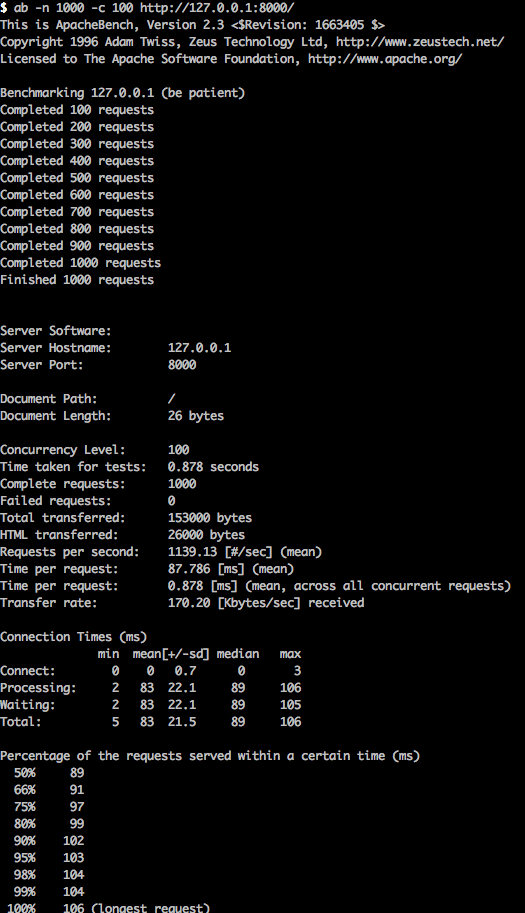

#Pub Sub Node Demo

- [faye](http://faye.jcoglan.com)
- [Nodejs](https://nodejs.org/en/)

##Usage

- Start server with `npm start`
- In another console run `bundle` and then `bundle exec ruby subscriber.rb`

Now navigate to [http://localhost:8000/](http://localhost:8000/) and you wil be able to see the sample message on the console.

##Speed
